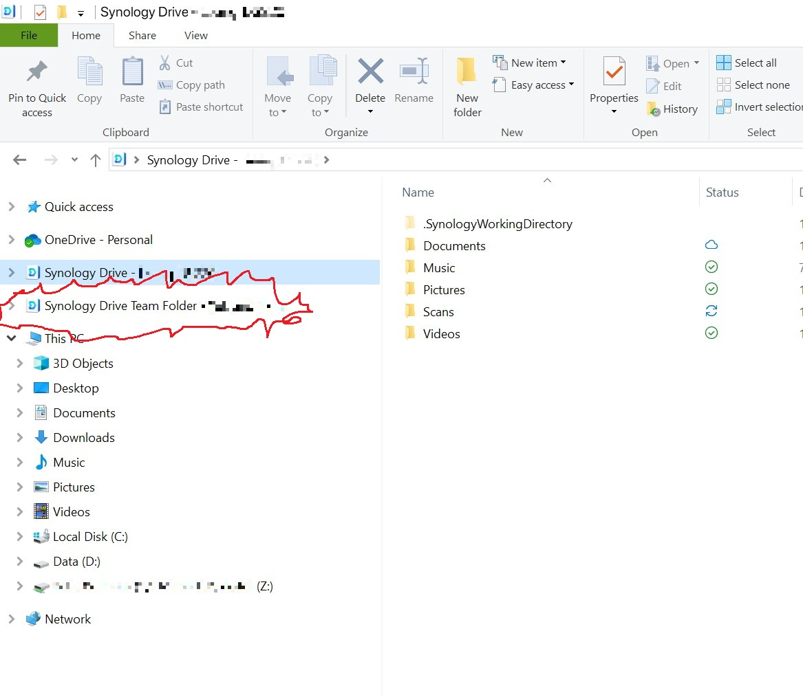
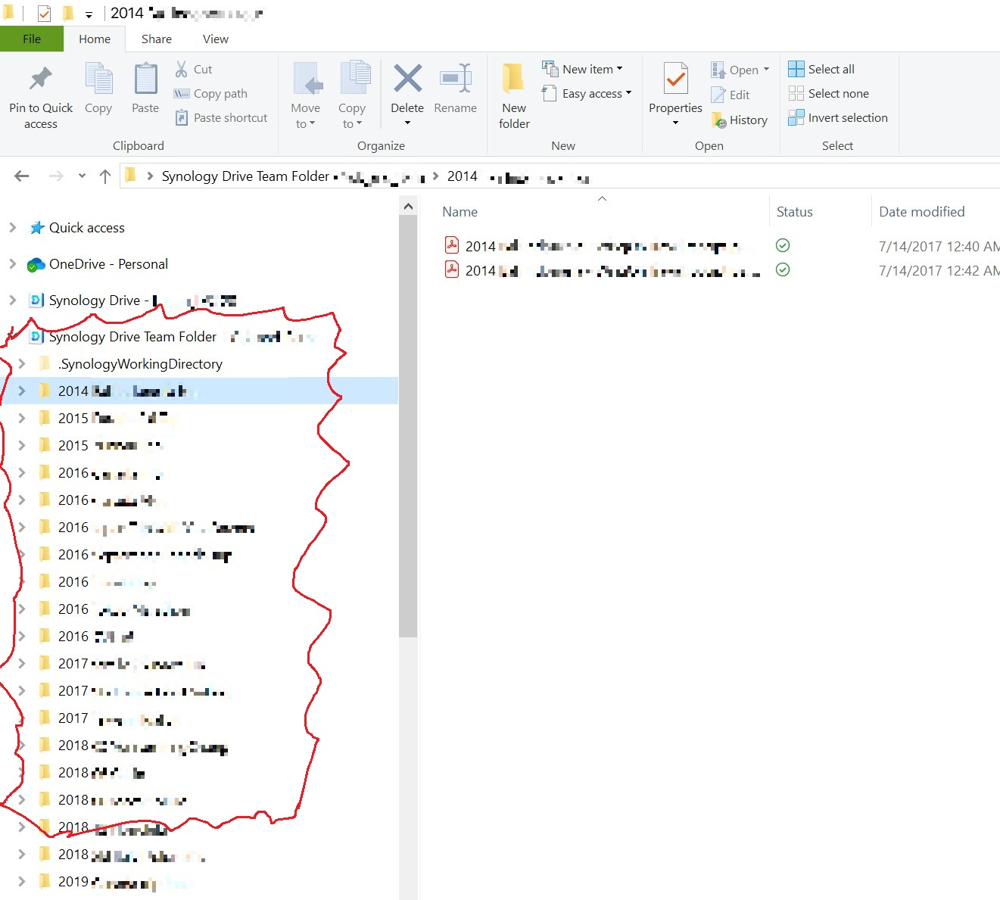

# Synology Drive Client for Windows - Making Team Folders visible in Windows's File Explorer Navigation Pane
For the longest time I have been baffled by how the Synology Drive Client presents the Team Folder (and My Drive as well).  You will probably know what I am talking about if you have used the MS OneDrive Client before.

... Why can't it look and work like OneDrive, which is way easier and convenient?  Just make the folder structure visible on the Navigation Pane, simple as that !

I was frustrated to the point where I decdided to start tweaking Windows, until I finally get Synology Drive Client to behave the way it should:

| Before Expanding        | After Expanding         |
| ----------------------  | ----------------------  |
|  |  |

If you want the same thing, just do the following:

1.  Download the two .reg files
   
2.  Before importing, open these files with notepad first, and make sure the "{0068B912-7C60-408D-917E-7EF898A41534}" doesn't yet exist in your registry (in the very unlikely event that it already exists, just replace each occurance to a value that doesn't yet exist.  You will need to make sure all occurances are replaced with the same new value.

3.  Import

4.  For "TargetFolderPath" (in "Computer\HKEY_CURRENT_USER\SOFTWARE\Classes\CLSID\{0068B912-7C60-408D-917E-7EF898A41534}\Instance\InitPropertyBag"), you will need to replace the path with the one you are actually using to sync with Synology Drive

5.  That's pretty much it

You can actually also change the "TargetFolderPath" under the CLSID for the original Synology Drive Client, to make the folder structure of your personal Synology Drive also appear in the navigation pane, much like the team folder's behavior.  That way it is all consistant across OneDrive, (Dropbox?), (Google Drive?), and Synology Drive.
